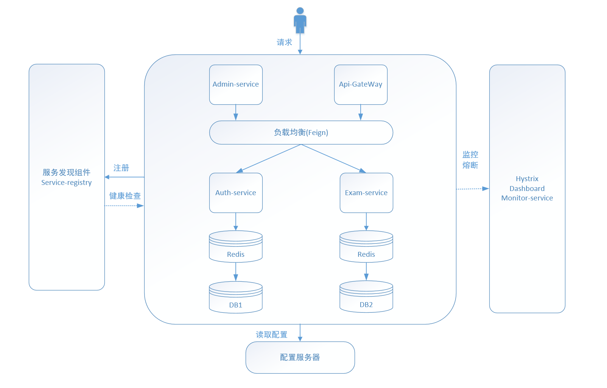
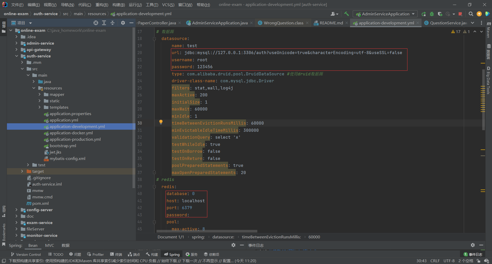
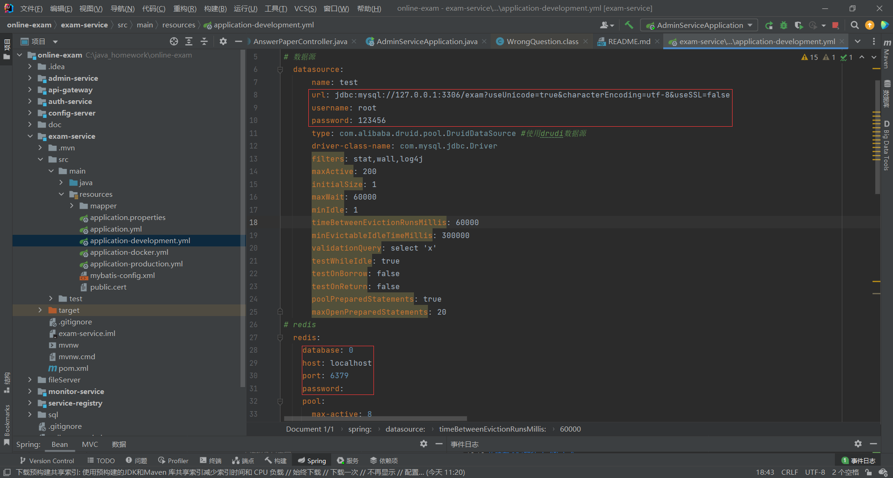
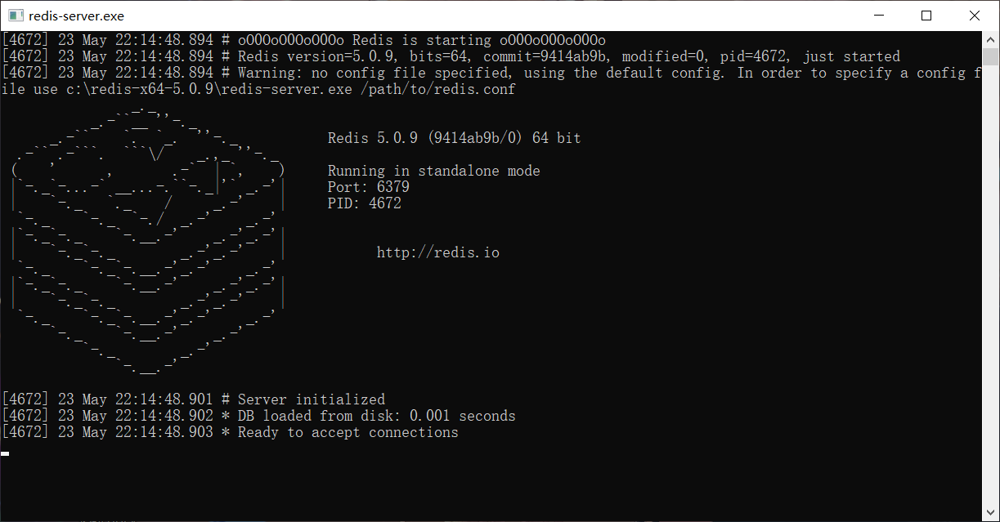
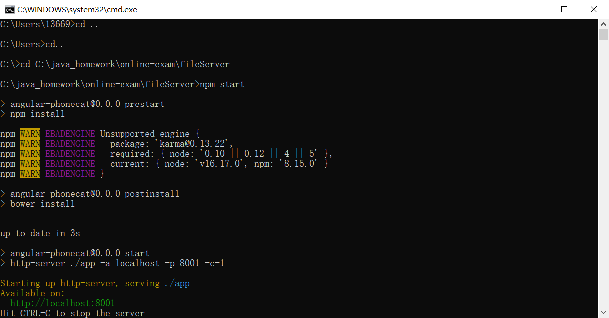
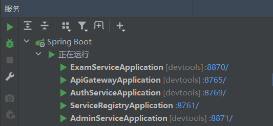
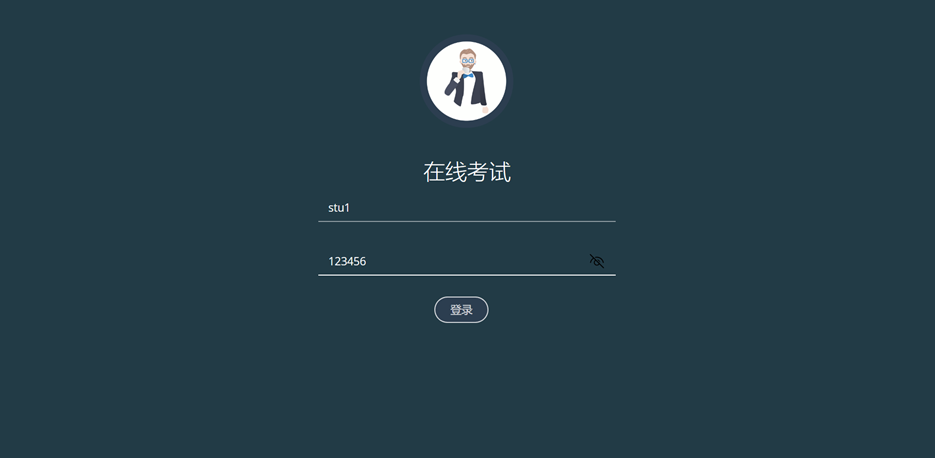
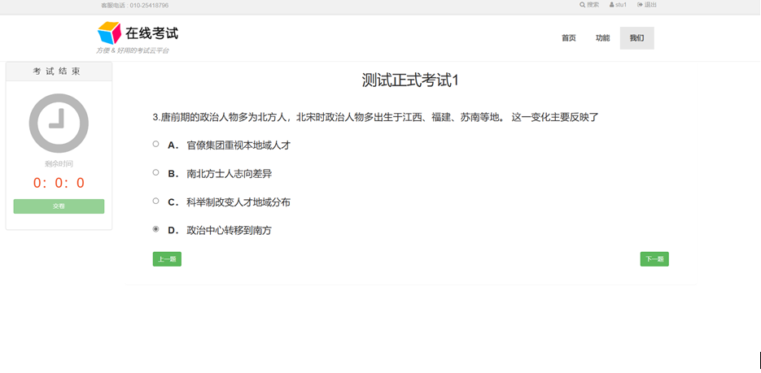
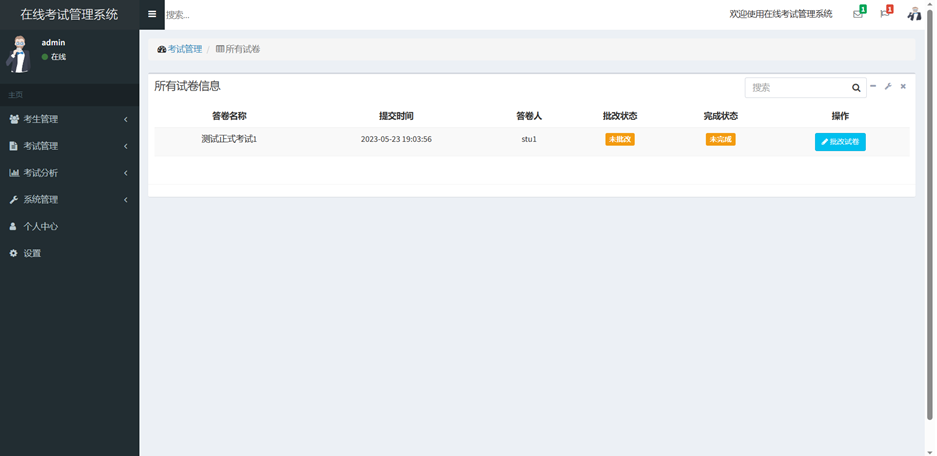

### 1.项目说明

本在线考试系统采用IntelliJ IDEA作为开发工具，后端使用Java,Spring Boot,Spring Cloud,MyBatis等框架，数据库采用MySQL，缓存使用Redis来提高性能。

### 2.系统架构图

### 3.部署方法

####3.1初始化数据库
在MySQL中创建auth和exam数据库，分别执行sql文件夹下的auth.sql和exam.sql脚本

####3.2修改项目中MySQL数据库和redis配置
auth-service:

exam-service:

####3.3启动redis
执行redis-server.exe

####3.4启动文件服务器
安装Node.js和npm。
命令行中cd到fileServer目录下，npm start启动

####3.5启动项目
分别启动以下微服务

### 4.测试
浏览器输入localhost:8765，访问在线考试系统前台。
首先点击登录，输入学生用户名：stu1 ，密码：123456

登入考试系统后，点击考试开始答题

浏览器输入localhost:8871，访问在线考试系统后台。
输入用户名：admin，密码：123456
